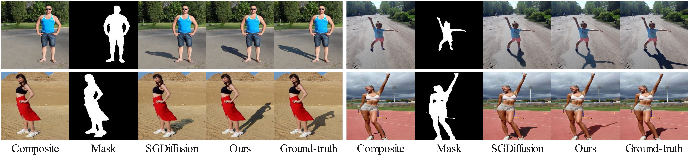

# GPSDiffusion-Object-Shadow-Generation

We propose **G**eometry **P**rior guided **S**hadow generation **Diffusion** model (GPSDifffusion), which significantly improves the shadow geometry. The visual comparision between [SGDiffusion](https://github.com/bcmi/Object-Shadow-Generation-Dataset-DESOBAv2) and our GPSDiffusion is shown below. From left to right, we show the composite image, foreground mask, the result of SGDiffusion, the result of our GPSDiffusion, and ground-truth. 

  
  

