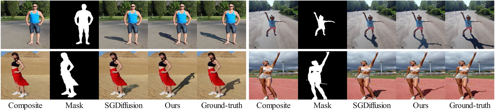
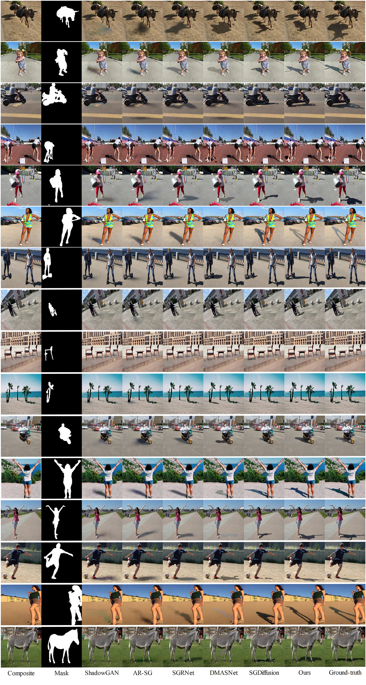

# GPSDiffusion-Object-Shadow-Generation

This is the official repository for the following paper:

> **Shadow Generation Using Diffusion Model with Geometry Prior** [[pdf]](https://openaccess.thecvf.com/content/CVPR2025/papers/Zhao_Shadow_Generation_Using_Diffusion_Model_with_Geometry_Prior_CVPR_2025_paper.pdf) [[supp]](https://openaccess.thecvf.com/content/CVPR2025/supplemental/Zhao_Shadow_Generation_Using_CVPR_2025_supplemental.pdf)    
>
> Haonan Zhao, Qingyang Liu, Xinhao Tao, Li Niu, Guangtao Zhai 
> Accepted by **CVPR 2025**.

Object shadow generation aims to generate plausible shadow for the inserted object in the composite image. We propose **G**eometry **P**rior guided **S**hadow generation **Diffusion** model (GPSDifffusion), which significantly improves the shadow geometry. The visual comparision between [SGDiffusion](https://github.com/bcmi/Object-Shadow-Generation-Dataset-DESOBAv2) and our GPSDiffusion is shown below. From left to right, we show the composite image, foreground mask, the result of SGDiffusion, the result of our GPSDiffusion, and ground-truth. 

  
  

We also provide the visual comparison with other baselines below. 

  
  

GPSDiffusion has been integrated into our image composition toolbox [libcom](https://github.com/bcmi/libcom). **Note that the performance of GPSDiffusion is unstable, so you need to generate multiple results and pick the most satisfactory one.** 

## 📢 News

**[2025/7/02]** [GPSDiffusion-SDXL](https://github.com/bcmi/GPSDiffusion-Object-Shadow-Generation-SDXL) is available now!

### Online Demo

Our GPSDiffusion has been integrated into [libcom](https://github.com/bcmi/libcom) toolbox. Try this [online demo](http://libcom.ustcnewly.com/) for image composition (object insertion) built upon [libcom](https://github.com/bcmi/libcom) toolbox and have fun!

[![]](https://github.com/user-attachments/assets/87416ec5-2461-42cb-9f2d-5030b1e1b5ec)

### Installation
- Clone this repo:
    git clone https://github.com/bcmi/GPSDiffusion-Object-Shadow-Generation.git
- Download the DESOBAv2 dataset from [[Baidu Cloud]](https://pan.baidu.com/s/1_nXb3ElxImmsq2BPcBGdPQ?pwd=bcmi) (access code: bcmi) or [[Dropbox]](https://www.dropbox.com/scl/fo/f71dg98aszqxtn2qs3l1c/ALS7dpAe3dBPbYbRaq10mnY?rlkey=6cm1vcma91yn06ziy3v4cxzxg&st=69kd9ihx&dl=0). Unzip `desobav2-256x256.rar` to `./data/`, and rename it to `desobav2`.
- Download the checkpoints from [[Baidu Cloud]](https://pan.baidu.com/s/1RYgwUsS1GX1-2MmRj2WRpA?pwd=bcmi) (access code: bcmi) or [[Dropbox]](https://www.dropbox.com/scl/fi/mwbf7boz4oe99256n20om/pretrained_models.zip?rlkey=ms4spjw4tpuntj9pr6zke7kcc&st=dqkbo6x9&dl=0). Unzip `pretrained_models.zip` to `./models/`.

### Environment
    conda create -n GPSDiffusion python=3.8
    conda activate GPSDiffusion
    pip install -r requirements.txt

### Training
    python train_GPSDiffusion.py

### Inference
    python infer_GPSDiffusion.py

### Post-processing
    python post_processing.py

### Evaluation
    python eval.py
    
## Other Resources

+ [Awesome-Object-Shadow-Generation](https://github.com/bcmi/Awesome-Object-Shadow-Generation)
+ [Awesome-Image-Composition](https://github.com/bcmi/Awesome-Object-Insertion)
